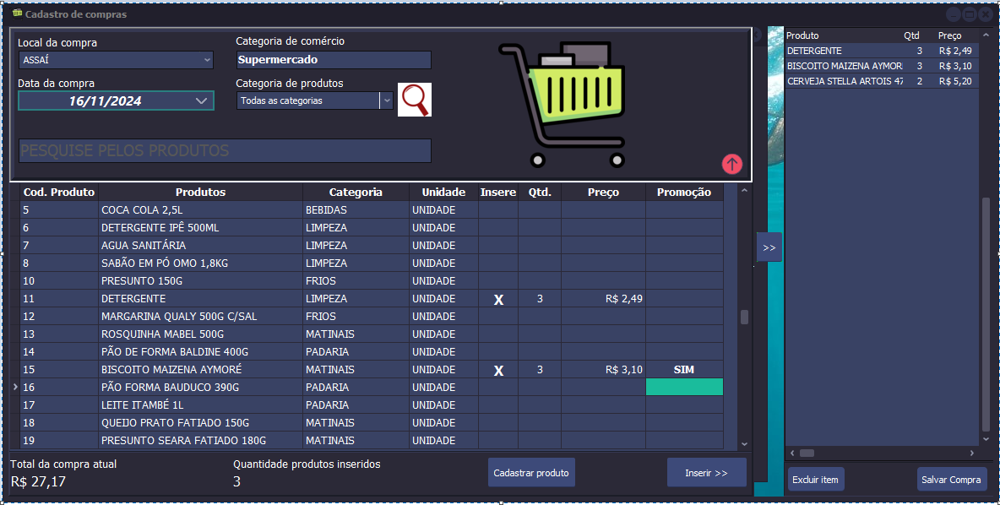
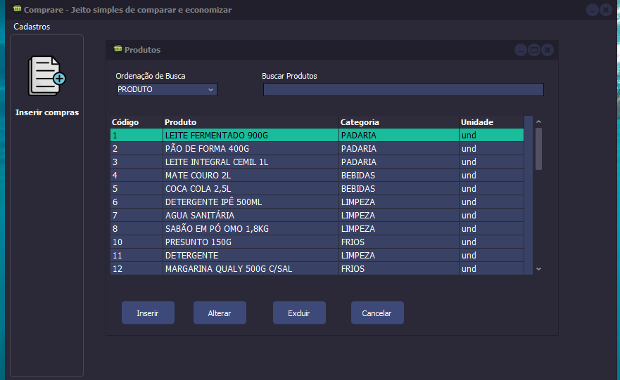

# Comprare
 Projeto destinado a armazenar o histórico de compras domésticas pessoais em supermercados.
 A cada compra realizada e importada para o sistema, me gera um histórico de produtos e preços em diferentes estabelecimentos.
 E a partir desse histórico, posso saber onde estou gastando mais, em qual local os preços tiveram maior alta de cada item,
 ter noção de como é o reajuste de preços de cada estabelecimento e ao criar uma nova lista de compras, o sistema me dará o local
 mais recomendado para realizar essa compra, baseado justamente nos dados de compras inseridos anteriormente.

## Status do projeto
Em andamento. Pausado por motivos de prioridades maiores.

## Demostrativo

## Tecnologias
* Delphi 10.4
* SQL Server 19
